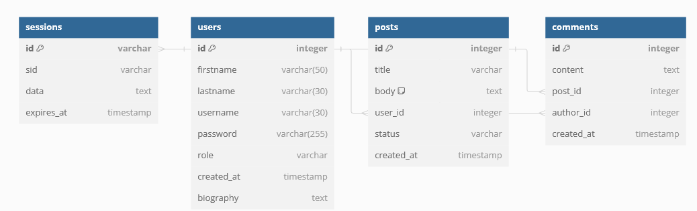

# Blog API
## Project Overview: 
1. [BlogAPI](https://github.com/Arussel1/blogAPI): The backend of the blog application built using Node.js and Express, handling routes for posts, users, and comments.

2. [BlogClient](https://github.com/Arussel1/blogClient): The user-facing client application built with React, TypeScript, and TailwindCSS. It allows users to:

   + Create and log in to accounts.
   + View posts.
   + Post comments. 

3. [AdminClient](https://github.com/Arussel1/blogAdmin): The admin-facing client with extended permissions, including:

    + All user permissions from BlogClient.
    + Creating and managing posts.
    + Changing post status (e.g., publish/unpublish).
    + Deleting comments. <br>
**Demo**: :point_right:[**Click here**](https://blog-client-7nj1um41c-arussel1s-projects.vercel.app/):point_left:. <br>
Please allow up to 1 minutes for the website to load.
## Install and set up
Follow these step below to set up the website in your local machine.

### Prerequisites:
Ensure [Node](https://nodejs.org/en) and [npm](https://www.npmjs.comnode) are installed in your computer.
### Steps:
1. Clone the repo: <br>

```bash
git clone https://github.com/YourUserName/blogAPI
```

2. Navigate to the project folder:<br>

```bash
cd blogAPI
```

3. Install the dependencies:<br>

```bash
npm install
```

4. Create the .env file:<br>

```bash
touch .env
```

5. Add your environment inside the file: <br>

```bash
DATABASE_URL=
FOO_COOKIE_SECRET=
SUPABASE_KEY=
SUPABASE_URL=
```

6. Start the dev server:<br>

```bash
npm run dev
```


After these step, you should browser and navigate to http://localhost:3000 to view the application in action.
## Production:

To prepare the project for production deployment, please use the following command: <br>

```bash
npm start
```

## Current route:

```bash

POST /admin/login: Authenticates an admin and returns a token.

POST /admin/signup: Registers a new admin user.

POST /users/signup: Registers a new user.

POST /users/login: Authenticates a user and returns a token.

GET /users/:userId: Retrieves user information by user ID.

PUT /users/:userId: Updates user information by user ID.

DELETE /users/:userId: Deletes a user by user ID.

GET /posts: Retrieves a list of posts.

GET /posts/:postId: Retrieves a specific post by post ID.

POST /posts: Creates a new post.

PUT /posts/:postId: Updates a post by post ID.

PATCH /posts/:postId: Toggles the active status of a post by post ID.

POST /posts/:postId/comments: Adds a comment to a post by post ID.

DELETE /posts/:postId: Deletes a post by post ID.
```

## Tech stack:
+ [Node](https://nodejs.org/en) as runtime environment. <br>
+ [Express](https://expressjs.com/) as backend framework. <br>
+ [PostgreSQL](https://www.postgresql.org/) SQL database for storing user, folder, and file information. <br>
+ [TypeScript](https://www.typescriptlang.org/) strongly-typed language for building robust and scalable applications. <br>
+ [Passport](https://www.passportjs.org/) Authentication middleware for managing user authentication and session handling in Node applications. <br>
+ [Prisma](https://www.prisma.io/) Simplified database relation and query for SQL and NoSQL databases. <br>
+ [Postman](https://www.postman.com/) API platform for building, testing and using APIs. <br>
+ [JWT](https://www.npmjs.com/package/jsonwebtoken) Securely transmitting information between parties as a JSON object.
+ [Supabase](https://supabase.com/) Open-source Firebase alternative providing backend services like authentication, databases, and storage.
## Database design:
